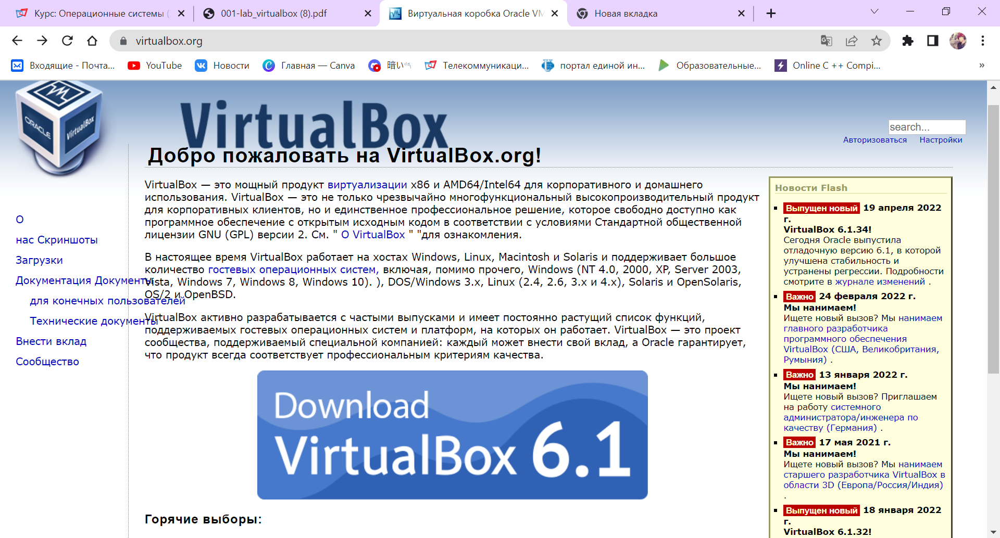

---
## Front matter
lang: ru-RU
title: Управлени версиями
author: |
	, Егина Ангелина НБИбд-01-21\inst{1}
	
institute: |
	\inst{1}Российский Университет Дружбы Народов
	
date: 27 апреля, 2022, Москва, Россия

## Formatting
toc: false
slide_level: 2
theme: metropolis
header-includes: 
 - \metroset{progressbar=frametitle,sectionpage=progressbar,numbering=fraction}
 - '\makeatletter'
 - '\beamer@ignorenonframefalse'
 - '\makeatother'
aspectratio: 43
section-titles: true
---

# Цели и задачи работы

## Цель лабораторной работы

Целью данной работы является изучение идеологии и применения средств контроля версий и освоение умений работать с git.

# Выполнение лабораторной работы №2

Описываются проведённые действия, в качестве иллюстрации даётся ссылка на иллюстрацию (рис. [-@fig:001])

Последовательность выполнения работы Настройка github - Создайте учётную запись на https://github.com

{ #fig:001 width=70% }

{#fig:002 width=70% }

Начальный этап установки Virtual Box

{#fig:003 width=70% }

{#fig:004 width=70% }

Запускаю виртуальную машину. Проверяю в свойствах виртулал бох место расположение каталога для виртуальных машин.
Создаю новую виртуальную машину и приступаю к настройке.

{#fig:005 width=70% }

{#fig:006 width=70% }

{#fig:007 width=70% }

{#fig:008 width=70% }

Также скачиваю дистрибутив Fedora, на которую была ссылка в лабораторной работе.

{#fig:009 width=70% }

Делаю все строго по лабораторной работе и устанавливаю Федору.

{#fig:0010 width=70% }

После установки изъяла диск из привода

{#fig:0011 width=70% }

{#fig:0012 width=70% }

# Выводы
Я научилась оформлять отчёты с помощью легковесного языка разметки Markdown.
Сделала отчёт по предыдущей лабораторной работе в формате Markdown.
Вкачестве отчёта предоставила отчёты в 3 форматах:pdf,docx иmd (вархиве,
поскольку он должен содержать скриншоты,Makefile ит.д.)

# Контрольные вопросы

1. Что такое системы контроля версий (VCS) и для решения каких задач они предназначаются?

Системы контроля версий (Version Control System, VCS) применяются при работе нескольких человек над одним проектом. Обычно основное дерево проекта хранится в локальном
или удалённом репозитории, к которому настроен доступ для участников проекта. При
внесении изменений в содержание проекта система контроля версий позволяет их
фиксировать, совмещать изменения, произведённые разными участниками проекта,
производить откат к любой более ранней версии проекта, если это требуется

2. Объясните следующие понятия VCS и их отношения: хранилище, commit, история, рабочая копия.

* хранилище - пространство на накопителе где расположен репозиторий
* commit - сохранение состояния хранилища 
* история - список изменений хранилища (коммитов)
* рабочая копия - локальная копия сетевого репозитория, в которой работает программист. Текущее состояние файлов проекта, основанное на версии, загруженной из хранилища (обычно на последней)

3. Что представляют собой и чем отличаются централизованные и децентрализованные VCS? Приведите примеры VCS каждого вида.

Централизованные системы контроля версий представляют собой приложения типа клиент-сервер, когда репозиторий проекта существует в единственном экземпляре и хранится на сервере. Доступ к нему осуществлялся через специальное клиентское приложение. В качестве примеров таких программных продуктов можно привести CVS, Subversion.

Распределенные системы контроля версий (Distributed Version Control System, DVCS) позволяют хранить репозиторий (его копию) у каждого разработчика, работающего с данной системой. При этом можно выделить центральный репозиторий (условно), в который будут отправляться изменения из локальных и, с ним же эти локальные репозитории будут синхронизироваться. При работе с такой системой, пользователи периодически синхронизируют свои локальные репозитории с центральным и работают непосредственно со своей локальной копией. После внесения достаточного количества изменений в локальную копию они (изменения) отправляются на сервер. При этом сервер, чаще всего, выбирается условно, т.к. в большинстве DVCS нет такого понятия как “выделенный сервер с центральным репозиторием”.

4. Опишите действия с VCS при единоличной работе с хранилищем.

Один пользователь работает над проектом и по мере необходимости делает коммиты, сохраняя определенные этапы.

5. Опишите порядок работы с общим хранилищем VCS.

Несколько пользователей работают каждый над своей частью проекта. При этом каждый должен работать в своей ветки. При завершении работы ветка пользователя сливается с основной веткой проекта. 

6. Каковы основные задачи, решаемые инструментальным средством git?

* Ведение истории версий проекта: журнал (log), метки (tags), ветвления (branches).
* Работа с изменениями: выявление (diff), слияние (patch, merge).
* Обеспечение совместной работы: получение версии с сервера, загрузка обновлений на сервер.

7. Назовите и дайте краткую характеристику командам git.

* git config - установка параметров
* git status - полный список изменений файлов, ожидающих коммита
* git add . - сделать все измененные файлы готовыми для коммита.
* git commit -m "[descriptive message]" - записать изменения с заданным сообщением.
* git branch - список всех локальных веток в текущей директории.
* git checkout [branch-name] - переключиться на указанную ветку и обновить рабочую директорию.
* git merge [branch] — соединить изменения в текущей ветке с изменениями из заданной.
* git push - запушить текущую ветку в удаленную ветку.
* git pull - загрузить историю и изменения удаленной ветки и произвести слияние с текущей веткой.

8. Приведите примеры использования при работе с локальным и удалённым репозиториями.

* git remote add [имя] [url] — добавляет удалённый репозиторий с заданным именем;
* git remote remove [имя] — удаляет удалённый репозиторий с заданным именем;
* git remote rename [старое имя] [новое имя] — переименовывает удалённый репозиторий;
* git remote set-url [имя] [url] — присваивает репозиторию с именем новый адрес;
* git remote show [имя] — показывает информацию о репозитории.

9. Что такое и зачем могут быть нужны ветви (branches)?

Ветвление — это возможность работать над разными версиями проекта: вместо одного списка с упорядоченными коммитами история будет расходиться в определённых точках. Каждая ветвь содержит легковесный указатель HEAD на последний коммит, что позволяет без лишних затрат создать много веток. Ветка по умолчанию называется master, но лучше назвать её в соответствии с разрабатываемой в ней функциональностью.

10. Как и зачем можно игнорировать некоторые файлы при commit?

Зачастую нам не нужно, чтобы Git отслеживал все файлы в репозитории, потому что в их число могут входить:

# Список литературы {.unnumbered}

1. [Лекция Системы контроля версий](http://uii.mpei.ru/study/courses/sdt/16/lecture02.2_vcs.slides.pdf)
2. [GitHub для начинающих](https://devpractice.ru/git-for-beginners-part-1-what-is-vcs/)

