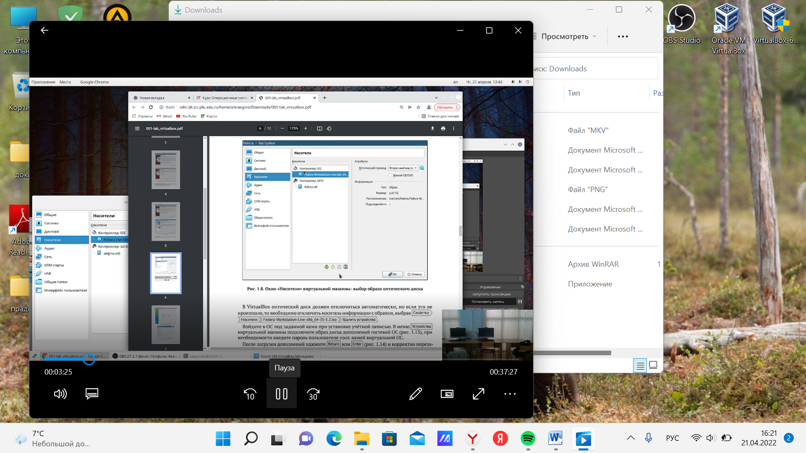

---
## Front matter
lang: ru-RU
title: Управлени версиями
author: |
	, Егина Ангелина НБИбд-01-21\inst{1}
	
institute: |
	\inst{1}Российский Университет Дружбы Народов
	
date: 27 апреля, 2022, Москва, Россия

## Formatting
toc: false
slide_level: 2
theme: metropolis
header-includes: 
 - \metroset{progressbar=frametitle,sectionpage=progressbar,numbering=fraction}
 - '\makeatletter'
 - '\beamer@ignorenonframefalse'
 - '\makeatother'
aspectratio: 43
section-titles: true
---

# Цели и задачи работы

## Цель лабораторной работы

Целью данной работы является изучение идеологии и применения средств контроля версий и освоение умений работать с git.

# Выполнение лабораторной работы №2

Описываются проведённые действия, в качестве иллюстрации даётся ссылка на иллюстрацию.

Последовательность выполнения работы Настройка github - Создайте учётную запись на https://github.com

## Выполнение лабораторной работы №2

## Выполнение лабораторной работы №2

## Начальный этап установки Virtual Box

## Выполнение лабораторной работы №2

## Выполнение лабораторной работы №2

Запускаю виртуальную машину. Проверяю в свойствах виртулал бох место расположение каталога для виртуальных машин.
Создаю новую виртуальную машину и приступаю к настройке.

## Выполнение лабораторной работы №2

 { width=70% }

## Выполнение лабораторной работы №2

## Выполнение лабораторной работы №2

## Выполнение лабораторной работы №2

Также скачиваю дистрибутив Fedora, на которую была ссылка в лабораторной работе.

## Выполнение лабораторной работы №2

Делаю все строго по лабораторной работе и устанавливаю Федору.

## Выполнение лабораторной работы №2

После установки изъяла диск из привода

## Выполнение лабораторной работы №2

# Выводы
Я научилась оформлять отчёты с помощью легковесного языка разметки Markdown.
Сделала отчёт по предыдущей лабораторной работе в формате Markdown.
Вкачестве отчёта предоставила отчёты в 3 форматах:pdf,docx иmd (вархиве,
поскольку он должен содержать скриншоты,Makefile ит.д.)

# Список литературы {.unnumbered}

1. [Лекция Системы контроля версий](http://uii.mpei.ru/study/courses/sdt/16/lecture02.2_vcs.slides.pdf)
2. [GitHub для начинающих](https://devpractice.ru/git-for-beginners-part-1-what-is-vcs/)

