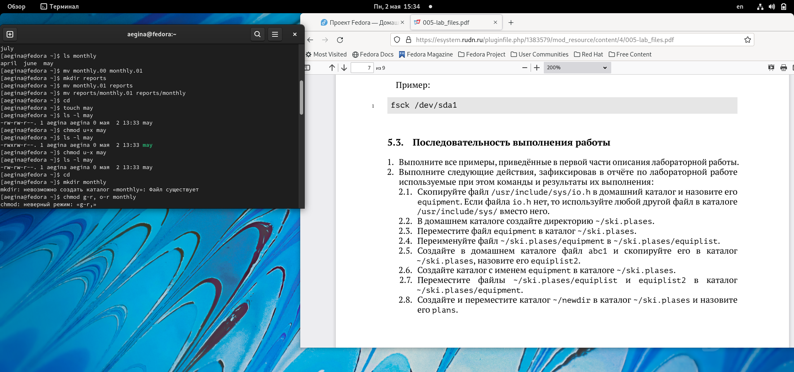
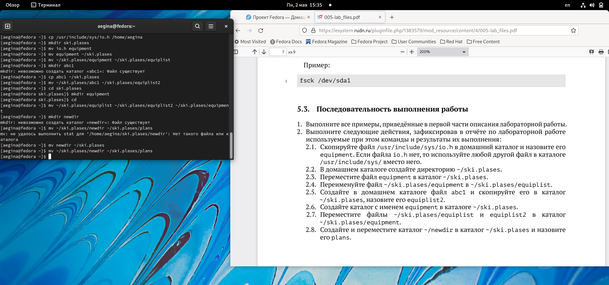
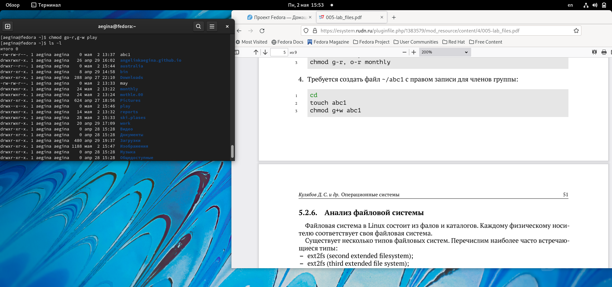
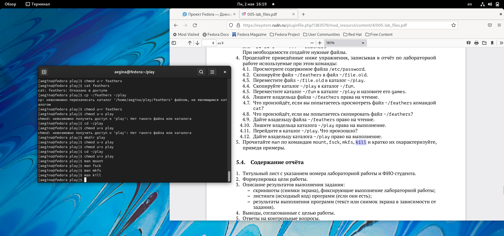
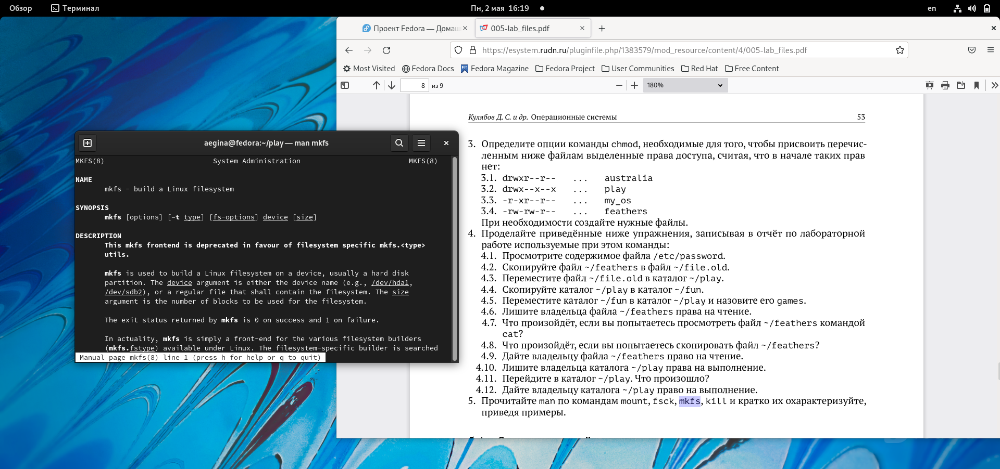

---
## Front matter
lang: ru-RU
title: "Презентация по лабораторной работе №5"
author: Егина Ангелина НБИбд-01-21
institute: Российский университет дружбы народов
date: 02.05.2022

## Formatting
toc: false
slide_level: 2
theme: metropolis
header-includes: 
 - \metroset{progressbar=frametitle,sectionpage=progressbar,numbering=fraction}
 - '\makeatletter'
 - '\beamer@ignorenonframefalse'
 - '\makeatother'
aspectratio: 43
section-titles: true
---

# Цель работы

Ознакомление с файловой системой Linux, её структурой, именами и содержанием каталогов. Приобретение практических навыков по применению команд для работы с файлами и каталогами,по управлению процессами (и работами),по проверке использования диска и обслуживанию файловой системы.

# Задание
1. Выполнитевсепримеры,приведённыевпервойчастиописаниялабораторнойработы.
2. Выполните следующие действия, зафиксировав в отчёте по лабораторной работе
используемые при этом команды и результаты их выполнения:
2.1. Скопируйте файл /usr/include/sys/io.h в домашний каталоги назовите его
equipment.Если файла io.h нет,то используйтелюбойдругой файл в каталоге
/usr/include/sys/ вместо него.

# Задание
2.2. В домашнем каталоге создайте директорию ~/ski.plases.
2.3. Переместите файл equipment в каталог ~/ski.plases.
2.4. Переименуйте файл ~/ski.plases/equipment в ~/ski.plases/equiplist.
2.5. Создайте в домашнем каталоге файл abc1 и скопируйте его в каталог
~/ski.plases,назовите его equiplist2.
2.6. Создайте каталог с именем equipment в каталоге ~/ski.plases.

# Задание
2.7. Переместите файлы ~/ski.plases/equiplist и equiplist2 в каталог
~/ski.plases/equipment.
2.8. Создайте и переместите каталог ~/newdir в каталог ~/ski.plases и назовите его plans.
3. Определите опции команды chmod,необходимые длятого,чтобы присвоить перечисленным ниже файлам выделенные права доступа, считая, что в начале таких прав нет:
3.1. drwxr--r-- ... australia
3.2. drwx--x--x ... play

# Задание
3.3. -r-xr--r-- ... my_os
3.4. -rw-rw-r-- ... feathers
При необходимости создайте нужные файлы.
4. Проделайте приведённые ниже упражнения, записывая в отчёт по лабораторной
работе используемые при этом команды:
4.1. Просмотрите содержимое файла /etc/password.

# Задание
4.2. Скопируйте файл ~/feathers в файл ~/file.old.
4.3. Переместите файл ~/file.old в каталог ~/play.
4.4. Скопируйте каталог ~/play в каталог ~/fun.
4.5. Переместите каталог ~/fun в каталог ~/play и назовите его games.
4.6. Лишите владельца файла ~/feathers права на чтение.
4.7. Что произойдёт,если вы попытаетесь просмотреть файл ~/feathers командой cat?

# Задание
4.8. Что произойдёт,если вы попытаетесь скопировать файл ~/feathers?
4.9. Дайте владельцу файла ~/feathers право на чтение.
4.10. Лишите владельца каталога ~/play права на выполнение.
4.11. Перейдите в каталог ~/play.Что произошло?
4.12. Дайте владельцу каталога ~/play право на выполнение.
5. Прочитайте man по командам mount,fsck,mkfs,kill и кратко их охарактеризуйте, приведя примеры.

# Выполнение лабораторной работы
Скопировала файл ~/abc1 в файл april и в файл may.Скопировала файл april и may в каталог monthly. Скопировала файл  monthly/may в файл с именем june. Скопировала каталог monthly в каталог monthly.00. Скопировала каталог monthly.00 в каталог /tmp

# Выполнение лабораторной работы

# Выполнение лабораторной работы

# Выполнение лабораторной работы

# Выполнение лабораторной работы

# Выполнение лабораторной работы
Выполнила следующие действия, зафиксировав в отчёте по лабораторной работе используемые при этом команды и результаты их выполнения:

# Выполнение лабораторной работы
Переместила файл ~/ski.plases в каталог командой mv. Переименоваала файл ~/ski.plases/equipment в ~/ski.plases/equiplist командой mv. Создала в домашнем каталоге файл abc1 и скопировала его в каталог ~/ski.plases командой ср, назвала его equiplist2 командой mv.

# Выполнение лабораторной работы

# Выполнение лабораторной работы
Определила опции команды chmod, необходимые для того, чтобы присвоить перечисленным ниже файлам выделенные права доступа, считая, что в начале таких прав нет. При необходимости создала нужные файлы.

# Выполнение лабораторной работы

# Выполнение лабораторной работы

# Выполнение лабораторной работы

# Выполнение лабораторной работы

# Выполнение лабораторной работы
Проделала приведённые ниже упражнения. записывая в отчёт по лабораторной работе используемые при этом команды:

# Выполнение лабораторной работы

# Выполнение лабораторной работы

# Выполнение лабораторной работы

# Выполнение лабораторной работы

# Выполнение лабораторной работы

# Выполнение лабораторной работы

# Выполнение лабораторной работы

# Выполнение лабораторной работы
Краткая характеристика:
- mount применяется для монтирования файловых систем.
- fsck  восстанавливает повреждённую файловую систему или проверяет на целостность.
- mkfs создаёт новую файловую систему.
- kill используется для принудительного завершения работы приложений.

# Выводы
Ознакомилась с файловой системой linux. её структурой, именами и содержанием каталогов. Приобрела практические навыки по применению команд для работы с файлами и каталогами, по управлению процессами (и работами), по проверке использования диска и обслуживанию файловой системы.

