---
## Front matter
lang: ru-RU
title: "Презентация по лабораторной работе №6"
author: Егина Ангелина НБИбд-01-21
institute: Российский университет дружбы народов
date: 03.05.2022

## Formatting
toc: false
slide_level: 2
theme: metropolis
header-includes: 
 - \metroset{progressbar=frametitle,sectionpage=progressbar,numbering=fraction}
 - '\makeatletter'
 - '\beamer@ignorenonframefalse'
 - '\makeatother'
aspectratio: 43
section-titles: true
---

# Цель работы

Ознакомление с инструментами поиска файлов и фильтрации текстовых данных. Приобретение практических навыков: по управлению процессами (и заданиями), по проверке использования диска и обслуживанию файловых систем.

# Задание

1. Осуществите вход в систему,используя соответствующее имя пользователя.
2. Запишите в файл file.txt названия файлов,содержащихся в каталоге etc.Допишите в этот же файл названия файлов,содержащихся в вашем домашнем каталоге.
3. Выведите имена всех файлов из file.txt,имеющих расширение .conf,после чего запишите их в новыйтекстовой файл conf.txt.
4. Определите,какие файлы в вашем домашнем каталоге имеют имена,начинавшиеся с символа c? Предложите несколько вариантов,как это сделать.
5. Выведите на экран (по странично) имена файлов из каталога /etc,начинающиеся с символа h.

## Задание
6. Запустите в фоновом режиме процесс,который будетзаписывать в файл ~/logfile файлы,имена которых начинаются с log.
7. Удалите файл ~/logfile.
8. Запустите из консоли в фоновом режиме редактор gedit.
9. Определитеидентификаторпроцессаgedit,используякомандуps,конвейерифильтр grep.Как ещё можно определить идентификатор процесса?
10. Прочтите справку (man) команды kill, после чего используйте её для завершения процесса gedit.
11. Выполните команды df и du,предварительно получив более подробную информацию об этих командах,с помощью команды man.
12. Воспользовавшись справкой команды find,выведите имена всех директорий,имеющихся в вашем домашнем каталоге.

# Выполнение лабораторной работы

1. Осуществила вход в систему, используя соответствующее имя пользователя

## Выполнение лабораторной работы

2. Записала в файл file.txt названия файлов, содержащихся в каталоге /etc. Дописала в этот же файл названия файлов, содержащихся в домашнем каталоге.
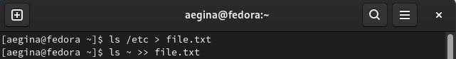

## Выполнение лабораторной работы

3. Вывела имена всех файлов из file.txt, имеющих расширение .conf, после чего записала их в новый текстовый файл conf.txt.
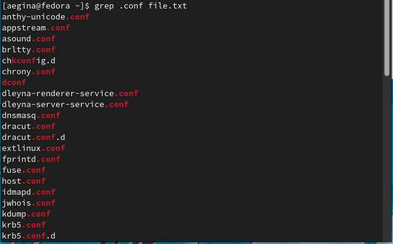

## Выполнение лабораторной работы

1

## Выполнение лабораторной работы

4. Определила, какие файлы в домашнем каталоге имеют имена, начинающиеся с с символа с. Несколько вариантов, как это сделать:
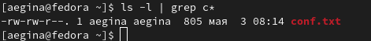

## Выполнение лабораторной работы

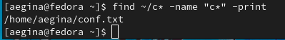

## Выполнение лабораторной работы

5. Вывела на экран (по странично) имена файлов из каталога /etc, начинающиеся с символа h.
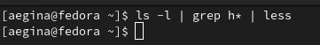

## Выполнение лабораторной работы

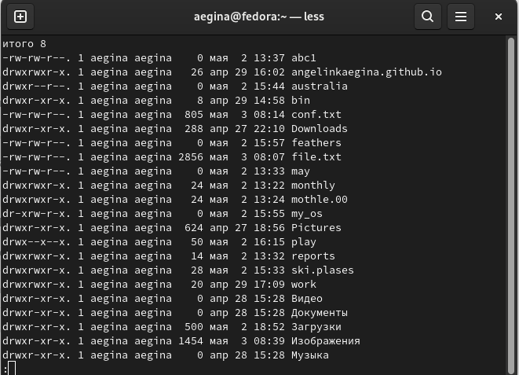

## Выполнение лабораторной работы

6. Запустила в фоновом режиме процесс, который будет записывать в файл ~/logfile файлы, имена которых начинаются с log.
7. Удалила файл ~/logfile.

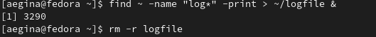

## Выполнение лабораторной работы

8. Запустила из консоли в фоновом режиме редактор gedit.
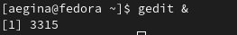

## Выполнение лабораторной работы

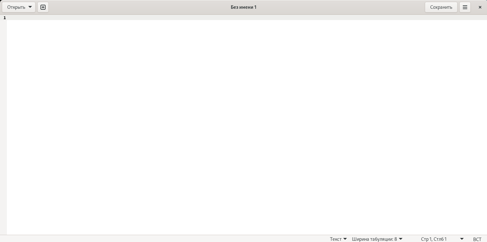

## Выполнение лабораторной работы

9. Определила индификатор процесса gedit, используя команду ps, конвейер и фильтр grep. Более простым способом определить этот индификатор не получилось.
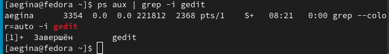

## Выполнение лабораторной работы

10. Прочитала справку ( man) команды kill, после чего использовала её для завершения процесса gedit.
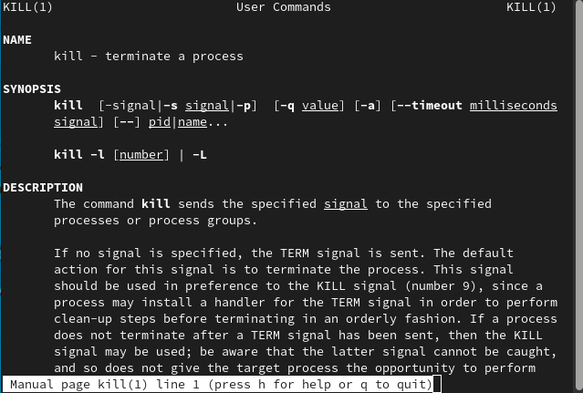

## Выполнение лабораторной работы

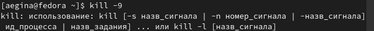

## Выполнение лабораторной работы

11. Выполнила команды df и du, предварительно получив более подробную информацию об этих командах, с помощью команды man.
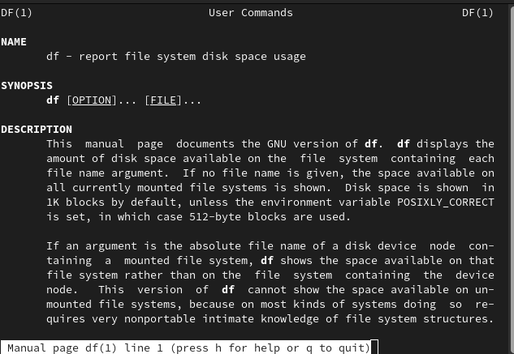

## Выполнение лабораторной работы

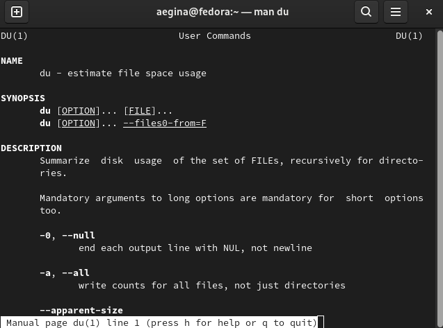

## Выполнение лабораторной работы

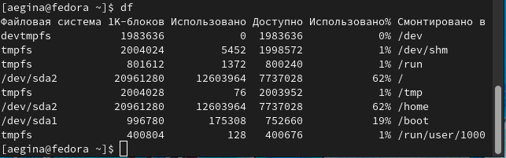

## Выполнение лабораторной работы

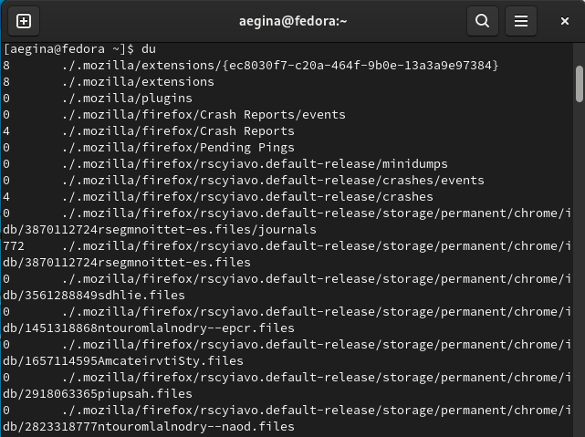

## Выполнение лабораторной работы

12. Воспользовавшись справкой команды find, вывела имена всех директорий, имеющихся в домашнем каталоге.
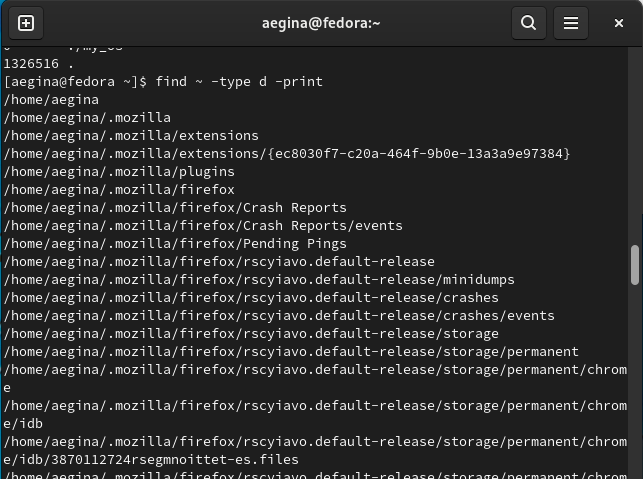
