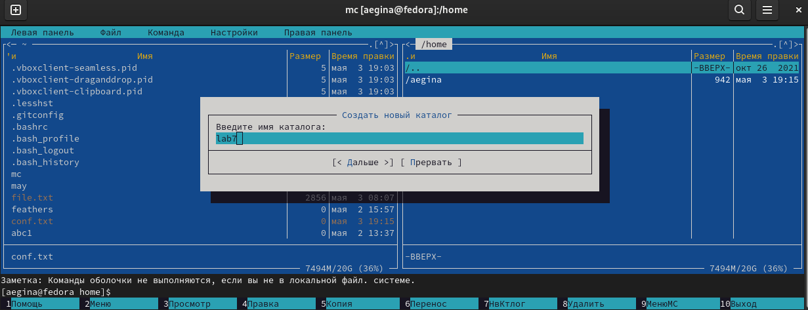

---
## Front matter
lang: ru-RU
title: Презентация по лабораторной работе №7
author: Егина Ангелина НБИбд-01-21
institute: Российский университет дружбы народов
date: 04.05.2022

## Formatting
toc: false
slide_level: 2
theme: metropolis
header-includes: 
 - \metroset{progressbar=frametitle,sectionpage=progressbar,numbering=fraction}
 - '\makeatletter'
 - '\beamer@ignorenonframefalse'
 - '\makeatother'
aspectratio: 43
section-titles: true
---

# Цель работы

Освоение основных возможностей командной оболочки Midnight Commander.Приоб-
ретение навыков практической работы по просмотру каталогов и файлов; манипуляций
с ними.

# Задание по mc

1. Изучите информацию о mc,вызвав в командной строке man mc.
2. Запустите из командной строки mc,изучите его структуру и меню.
3. Выполните несколько операций в mc,используя управляющие клавиши (операции
с панелями; выделение/отмена выделения файлов,копирование/перемещение фай-
лов, получение информации о размере и правах доступа на файлы и/или каталоги
ит.п.)
4. Выполните основные команды меню левой (или правой) панели.Оцените степень
подробности вывода информации о файлах.
5. Используя возможности подменю Файл ,выполните:
– просмотр содержимоготекстового файла;
– редактирование содержимого текстового файла (без сохранения результатов
редактирования);
– создание каталога;
– копирование в файлов в созданный каталог.

## Задание по mc

6. С помощью соответствующих средств подменю Команда осуществите:
– поиск в файловой системе файла с заданными условиями (например, файла
с расширением .c или .cpp,содержащего строку main);
– выбор и повторение одной из предыдущих команд;
– переход в домашний каталог;
– анализ файла меню и файла расширений.
7. Вызовите подменю Настройки .Освойте операции,определяющие структуру экрана mc
(Full screen,Double Width,Show Hidden Files ит.д.)ю

# Задание по встроенному редактору mc
1. Создайтетекстовой файл text.txt.
2. Откройте этот файл с помощью встроенного в mc редактора.
3. Вставьте в открытый файл небольшой фрагменттекста,скопированный из любого
другого файла или Интернета.
4. Проделайте стекстом следующие манипуляции,используя горячие клавиши:
4.1. Удалите строкутекста.
4.2. Выделите фрагменттекста и скопируйте его на новую строку.
4.3. Выделите фрагменттекста и перенесите его на новую строку.
4.4. Сохраните файл.
4.5. Отмените последнее действие.

## Задание по встроенному редактору mc
4.6. Перейдите в конец файла (нажав комбинацию клавиш) и напишите некоторый
текст.
4.7. Перейдите в начало файла (нажав комбинацию клавиш) и напишите некоторый
текст.
4.8. Сохраните и закройте файл.
5. Откройте файл с исходнымтекстом на некотором языке программирования (напри-
мер C или Java)
6. Используя меню редактора,включите подсветку синтаксиса,если она не включена,
или выключите,если она включена.

# Выполнение лабораторной работы

## Задание по mc
1. Изучилаинформацию о mc , вызвав в командной строке man mc.

## Задание по mc
2. Запустила из командной строки mc, изучила его структуру и меню.

## Задание по mc
3. Выполнила несколько операций в mc , используя управляющие клавиши ( операции с панелями; выделение/отмена выделения файлов,копирование/перемещение файлов, получение информации о размере и правах доступа на файлы и/или каталоги.
ит.п.)

## Задание по mc

## Задание по mc

## Задание по mc
4. Выполнила основные команды меню левой (или правой) панели. Вывод информации о файлах достаточно подробный.

## Задание по mc

## Задание по mc

## Задание по mc

## Задание по mc
5. Используя возможности подменю Файл ,выполните:
-просмотр содержимоготекстового файла;

## Задание по mc
-редактирование содержимого текстового файла (без сохранения результатов редактирования);

## Задание по mc
-создание каталога;

## Задание по mc
– копирование в файлов в созданный каталог.

## Задание по mc
6. 6. С помощью соответствующих средств подменю Команда осуществите:
– поиск в файловой системе файла с заданными условиями (например, файла с расширением .c или .cpp,содержащего строку main);

## Задание по mc

## Задание по mc
-выбор и повторение одной из предыдущих команд;

## Задание по mc
-переход в домашний каталог;

## Задание по mc
–анализ файла меню и файла расширений.

## Задание по mc

7. Вызовала подменю Настройки .Освоила операции,определяющие структуру экрана mc (Full screen,Double Width,Show Hidden Files ит.д.).

## Задание по mc

## Задание по встроенному редактору mc
1. Cоздала текстовый файл text.txt.

## Задание по mc
2. Открыла этот файл с помощью встроенного в mc редактора

## Задание по mc
3. Вставила в открытый файл небольшой фрагменттекста,скопированный из любого другого файла или Интернета.

## Задание по mc
4. Проделайте стекстом следующие манипуляции,используя горячие клавиши:
4.1. Удалите строкутекста.

## Задание по mc
4.2. Выделите фрагменттекста и скопируйте его на новую строку.

## Задание по mc
4.4. Сохранила файл.

## Задание по mc
4.5. Отменила последнее действие.

## Задание по mc
4.6. Перейдите в конец файла (нажав комбинацию клавиш) и напишите некоторый текст.

## Задание по mc
4.7. Перейдите в начало файла (нажав комбинацию клавиш) и напишите некоторый текст.

## Задание по mc
4.8. Сохранила и закрыла файл.

## Задание по mc
5. Открыла файл с исходным текстом в терминале.

## Задание по mc
6. Используя меню редактора,выключила подсветку синтаксиса.

# Выводы
Освоила основные возможности командной оболочки Midnight Commander.Приобрела навыки практической работы по просмотру каталогов и файлов; манипуляций с ними.
