---
## Front matter
lang: ru-RU
title: "Отчёт по индивидуальному проекту №3"
author: |
	"Егина Ангелина НБИбд-01-21"
institute: |
	"Российский университет дружбы народов"
date: 5 мая 2022 год

## Formatting
toc: false
slide_level: 2
theme: metropolis
header-includes: 
 - \metroset{progressbar=frametitle,sectionpage=progressbar,numbering=fraction}
 - '\makeatletter'
 - '\beamer@ignorenonframefalse'
 - '\makeatother'
aspectratio: 43
section-titles: true
---

# Цель работы

Добавить к сайту достижения.

# Задание

1. Список достижений.
Добавить информацию о навыках (Skills).
Добавить информацию об опыте (Experience).
Добавить информацию о достижениях (Accomplishments).
2. Сделать пост по прошедшей неделе.
3. Добавить пост на тему по выбору:
Легковесные языки разметки.
Языки разметки. LaTeX.
Язык разметки Markdown.

# Выполнение лабораторной работы

Захожу в домашнюю папку, затем в work,gelya,content,home.Перехожу в skills.md

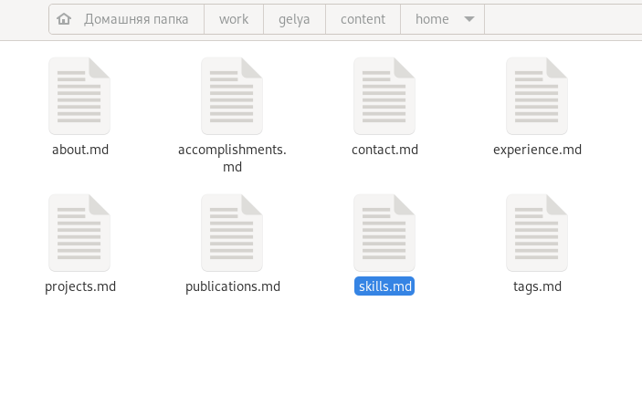

## 1. Добавляю информацию о своих навыках, переходя по ссылке.

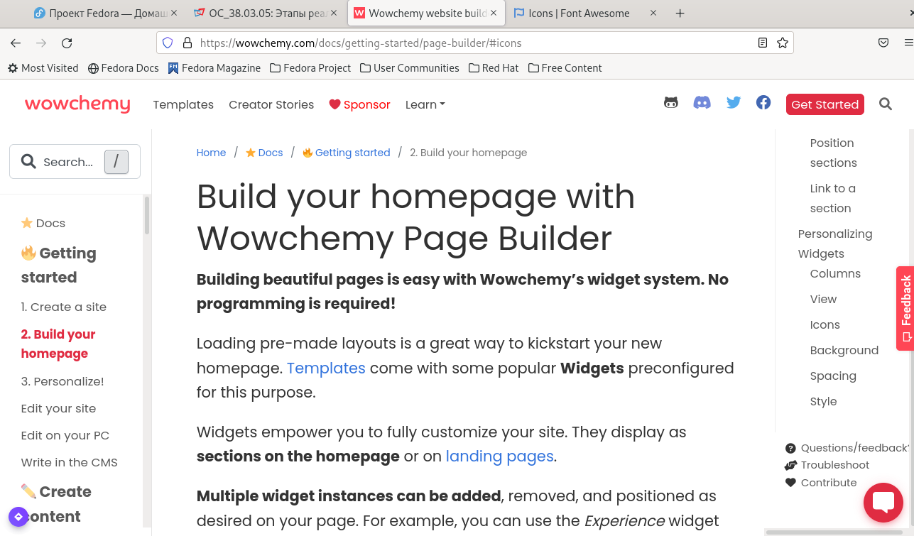

## 1. Добавляю информацию о своих навыках, переходя по ссылке.

Далее я добавляю информацию о навыках (Skills).
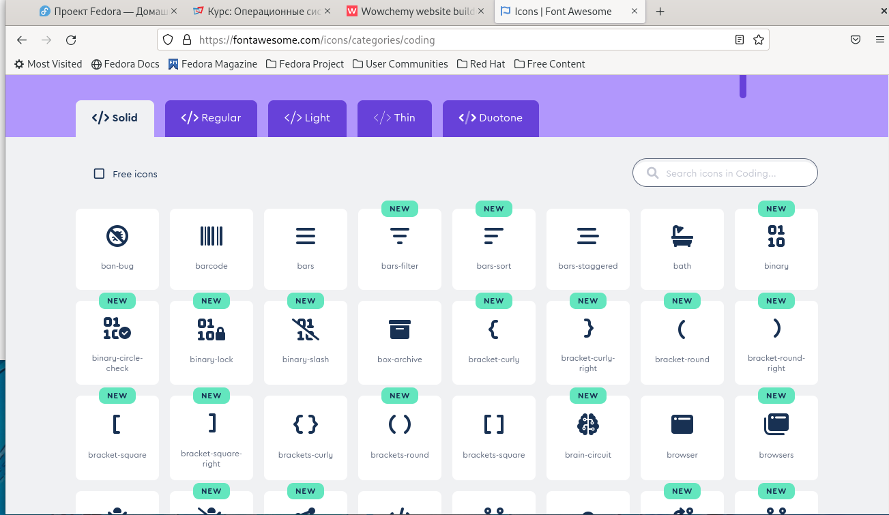

## 1. Добавляю информацию о своих навыках, переходя по ссылке.

После того, как я сделала лист со скилами, я перехожу в другой лист, который называется (Experience).
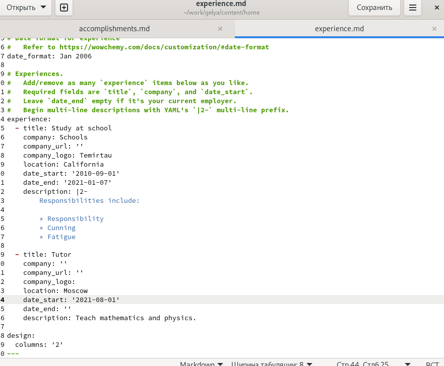

## 1. Добавляю информацию о своих навыках, переходя по ссылке.

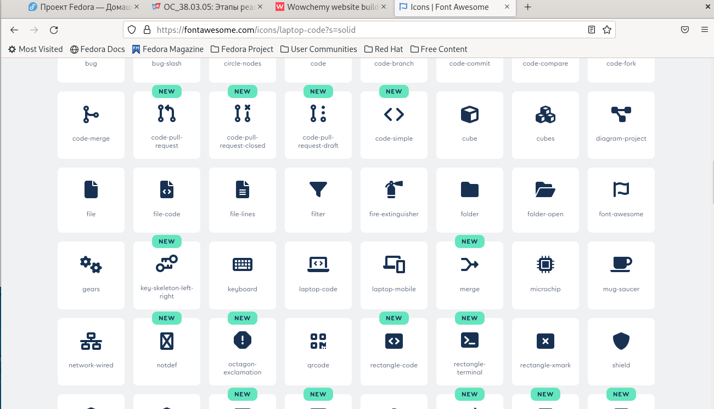

## 1. Добавляю информацию о своих навыках, переходя по ссылке.

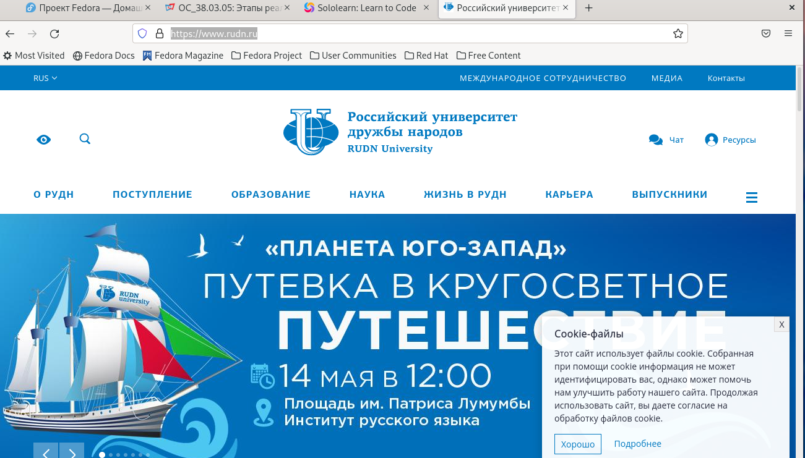

## 1. Добавляю информацию о своих навыках, переходя по ссылке.

Затем я перехожу к последнему этапу заданий из пункта 1, я перехожу в лист (Accomplishments). И начинаю работать с ним.
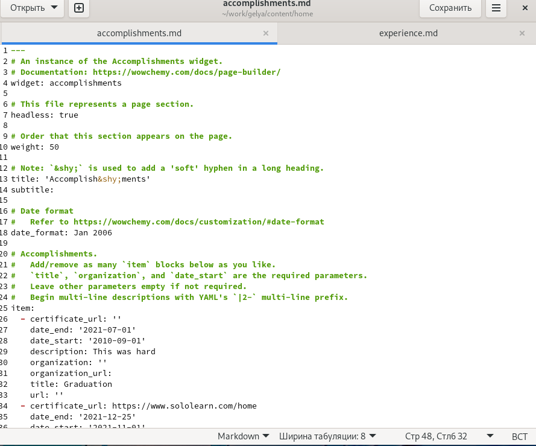

## 1. Добавляю информацию о своих навыках, переходя по ссылке.

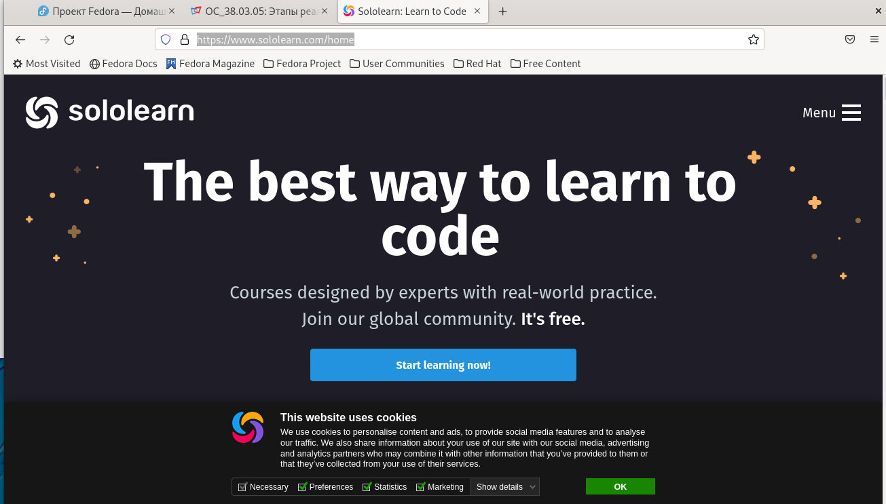

## 2. Я делала пост о прошедшей неделе, и добавила вот такую картинку:
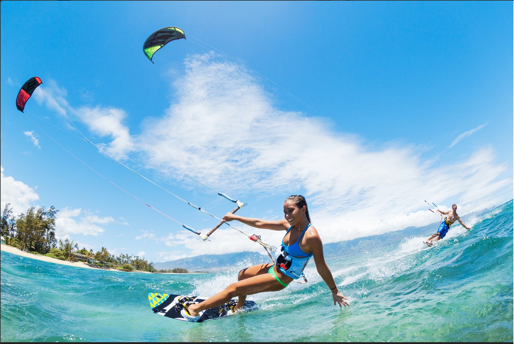

## 3. Последним этапом нужно было выбрать из перечисленных тем, создать пост о языках (на выбор). Я написала пост. И вставила такую картинку:
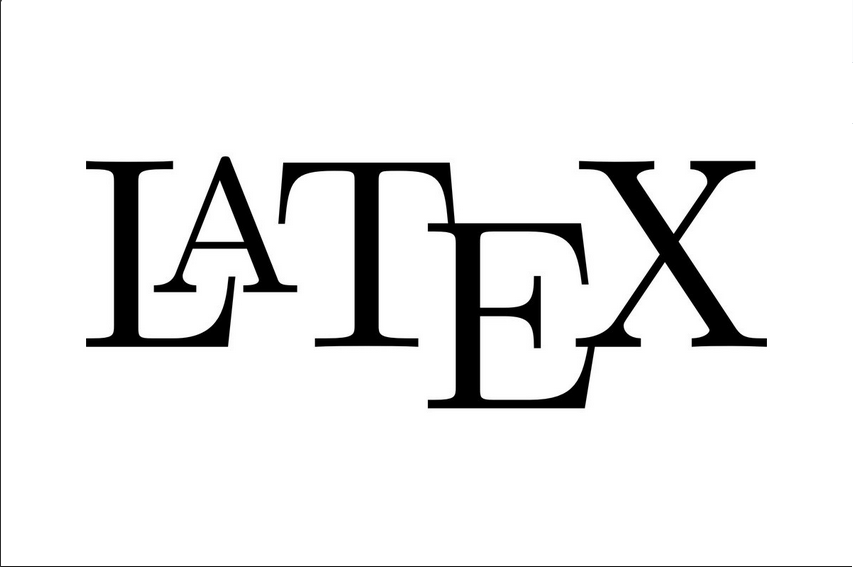

## 3. Последним этапом нужно было выбрать из перечисленных тем, создать пост о языках (на выбор). Я написала пост. И вставила такую картинку:

С помощью данных команд, я размещаю пост у себя на сайте.

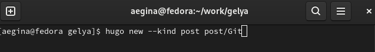

# Выводы

Я научилась добавлять к сайту сувои достижения.

