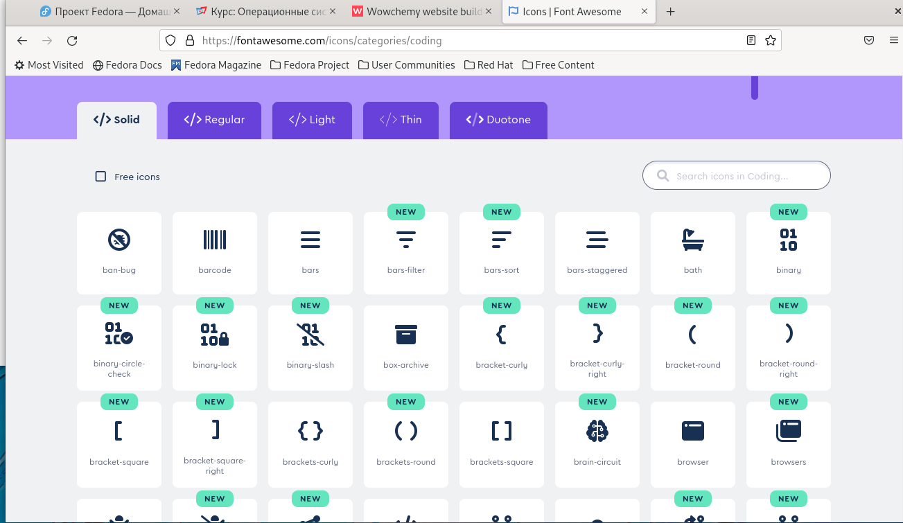
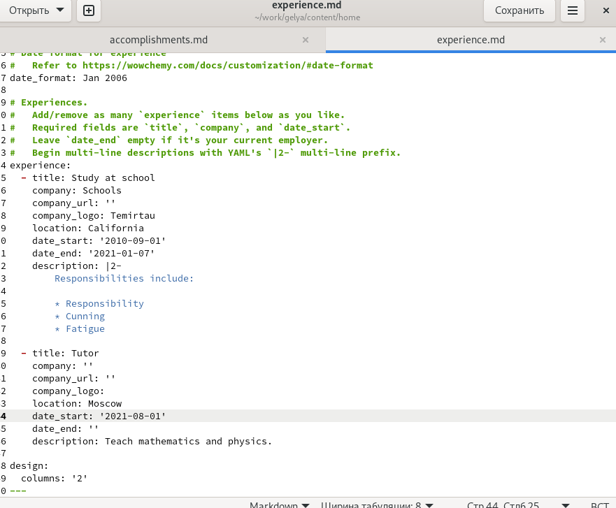
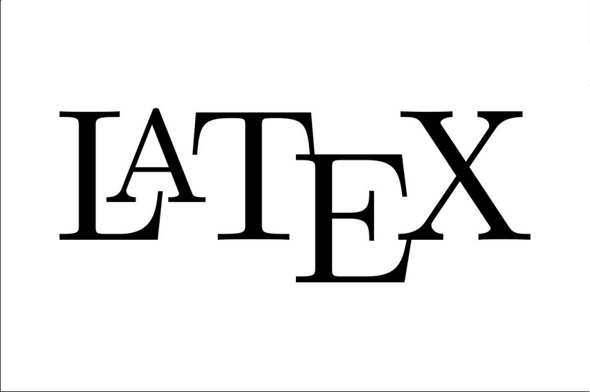
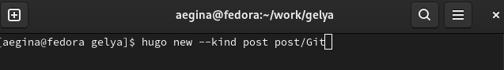

---
## Front matter
title: "Отчёт по индивидуальному проекту №3"
subtitle: "Добавление к сайту достижений"
author: "Егина Ангелина НБИбд-01-21"

## Generic otions
lang: ru-RU
toc-title: "Содержание"

## Bibliography
bibliography: bib/cite.bib
csl: pandoc/csl/gost-r-7-0-5-2008-numeric.csl

## Pdf output format
toc: true # Table of contents
toc-depth: 2
lof: true # List of figures
lot: true # List of tables
fontsize: 12pt
linestretch: 1.5
papersize: a4
documentclass: scrreprt
## I18n polyglossia
polyglossia-lang:
  name: russian
  options:
	- spelling=modern
	- babelshorthands=true
polyglossia-otherlangs:
  name: english
## I18n babel
babel-lang: russian
babel-otherlangs: english
## Fonts
mainfont: PT Serif
romanfont: PT Serif
sansfont: PT Sans
monofont: PT Mono
mainfontoptions: Ligatures=TeX
romanfontoptions: Ligatures=TeX
sansfontoptions: Ligatures=TeX,Scale=MatchLowercase
monofontoptions: Scale=MatchLowercase,Scale=0.9
## Biblatex
biblatex: true
biblio-style: "gost-numeric"
biblatexoptions:
  - parentracker=true
  - backend=biber
  - hyperref=auto
  - language=auto
  - autolang=other*
  - citestyle=gost-numeric
## Pandoc-crossref LaTeX customization
figureTitle: "Рис."
tableTitle: "Таблица"
listingTitle: "Листинг"
lofTitle: "Список иллюстраций"
lotTitle: "Список таблиц"
lolTitle: "Листинги"
## Misc options
indent: true
header-includes:
  - \usepackage{indentfirst}
  - \usepackage{float} # keep figures where there are in the text
  - \floatplacement{figure}{H} # keep figures where there are in the text
---

# Цель работы

Добавить к сайту достижения.

# Задание

1. Список достижений.
Добавить информацию о навыках (Skills).
Добавить информацию об опыте (Experience).
Добавить информацию о достижениях (Accomplishments).
2. Сделать пост по прошедшей неделе.
3. Добавить пост на тему по выбору:
Легковесные языки разметки.
Языки разметки. LaTeX.
Язык разметки Markdown.

# Выполнение лабораторной работы

Захожу в домашнюю папку, затем в work,gelya,content,home.Перехожу в skills.md

1. Добавляю информацию о своих навыках, переходя по ссылке.

Далее я добавляю информацию о навыках (Skills).

После того, как я сделала лист со скилами, я перехожу в другой лист, который называется (Experience).

Затем я перехожу к последнему этапу заданий из пункта 1, я перехожу в лист (Accomplishments). И начинаю работать с ним.

2. Я делала пост о прошедшей неделе, и добавила вот такую картинку:

3. Последним этапом нужно было выбрать из перечисленных тем, создать пост о языках (на выбор). Я написала пост. И вставила такую картинку:

С помощью данных команд, я размещаю пост у себя на сайте.

# Выводы

Я научилась добавлять к сайту сувои достижения.

