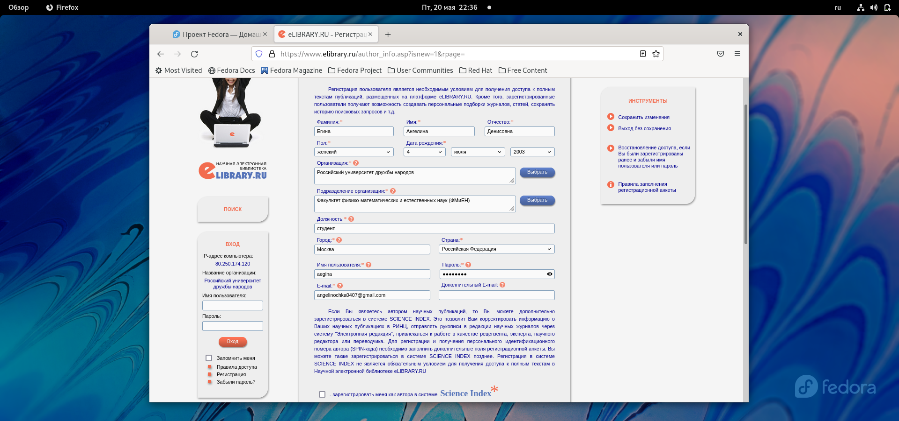
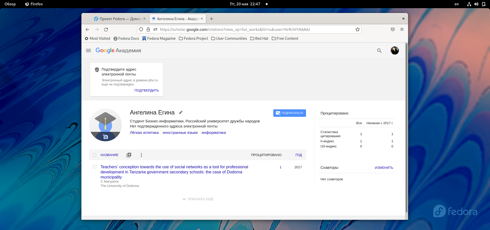
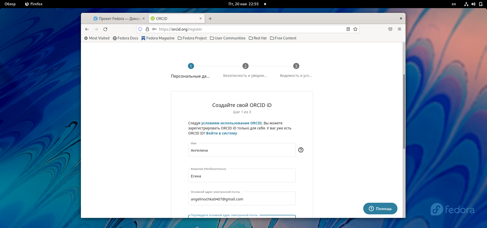
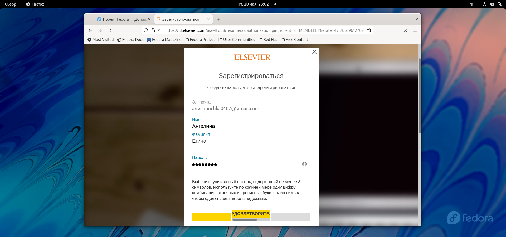
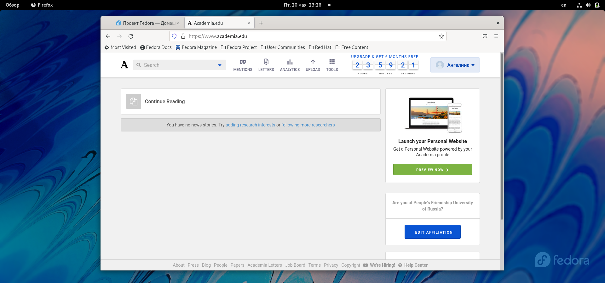
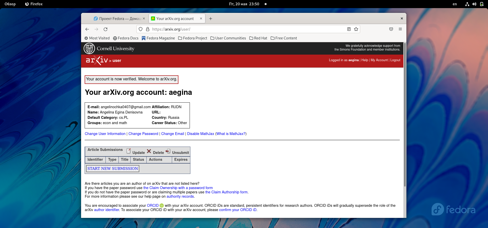
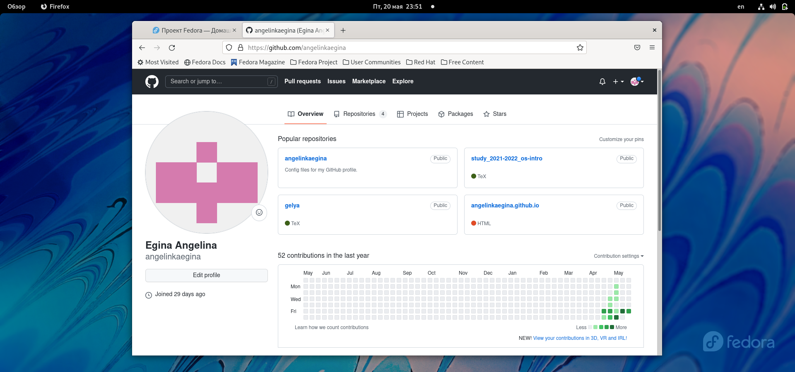
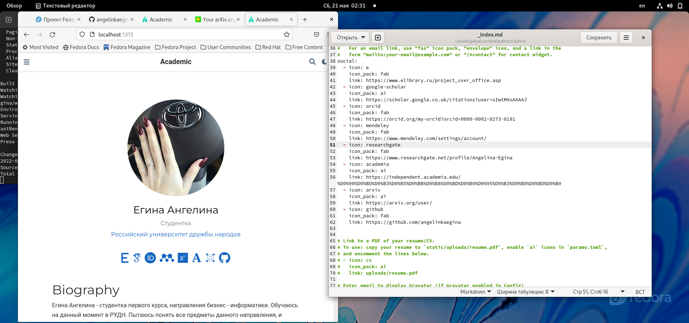
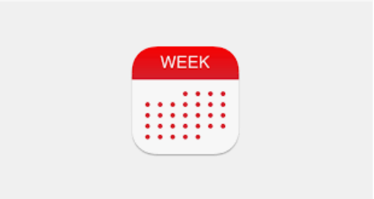

---
## Front matter
lang: ru-RU
title: "Презентация по индивидуальному проекту №4"
author: |
	Егина Ангелина НБИбд-01-21
institute: |
	Российский университет дружбы народов
date: 21.05.2022

## Formatting
toc: false
slide_level: 2
theme: metropolis
header-includes: 
 - \metroset{progressbar=frametitle,sectionpage=progressbar,numbering=fraction}
 - '\makeatletter'
 - '\beamer@ignorenonframefalse'
 - '\makeatother'
aspectratio: 43
section-titles: true
---

# Цель работы

Научиться :
1. Зарегистрироваться на сайтах
2. Написать пост (на тему по выбору):
- Оформление отчёта
- Создание презентаций
- Работа с библиографией
3. Написать пост о том, как проходила моя неделя.

# Задание

Зарегистрироваться на соответсвующих ресурсах и разместить на них ссылки на сайте.

# Выполнение лабораторной работы

## Прохожу регистрацию на всех сайтах.

# Выполнение лабораторной работы

# Выполнение лабораторной работы

# Выполнение лабораторной работы

# Выполнение лабораторной работы

# Выполнение лабораторной работы

# Выполнение лабораторной работы

# Выполнение лабораторной работы

# Выполнение лабораторной работы

## Создаю пост о том, как создавать презентпции:

# Выполнение лабораторной работы

Создаю пост по прошедшей неделе (вствляю картинку такую):

#Вывод:

Я научиласт создвать посты и регистрироваться на сайтах.

