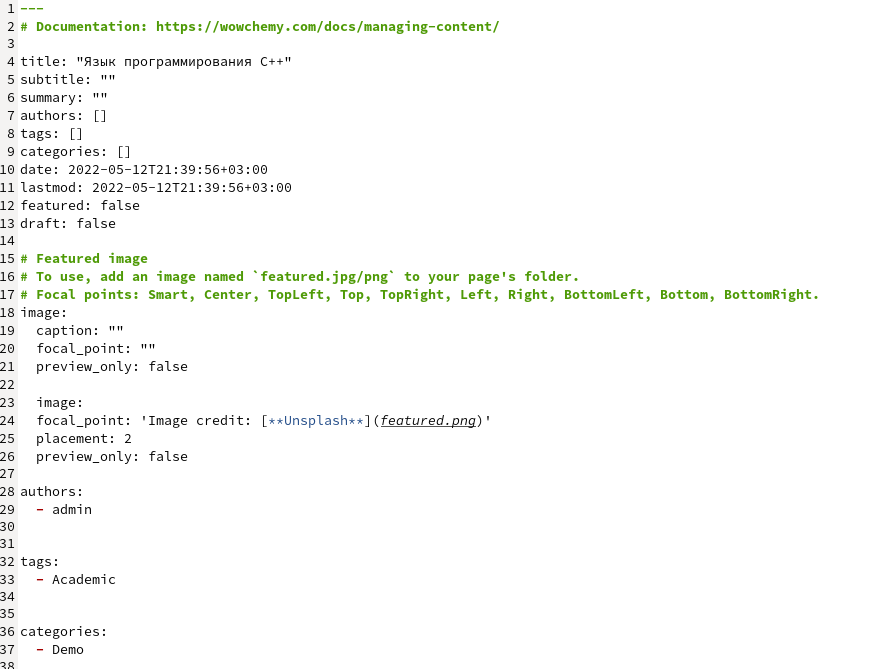
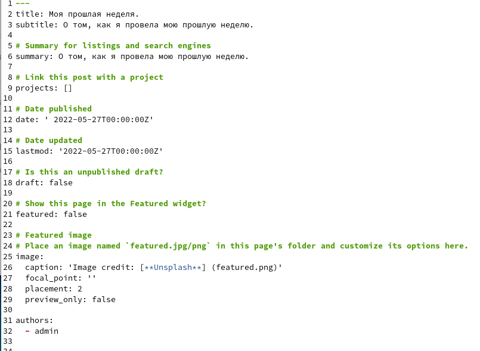
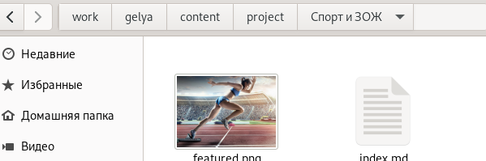
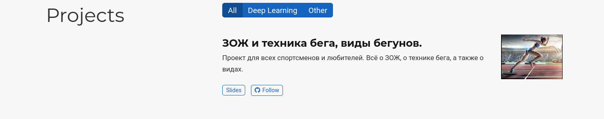

---
## Front matter
lang: ru-RU
title: Презентация по индивидуальному проекту часть 5.
author: |
	Егина Ангелина НБИбд-01-21
institute: |
	Российский университет дружбы народов
date: 28.05.2022 г. Москва

## Formatting
toc: false
slide_level: 2
theme: metropolis
header-includes: 
 - \metroset{progressbar=frametitle,sectionpage=progressbar,numbering=fraction}
 - '\makeatletter'
 - '\beamer@ignorenonframefalse'
 - '\makeatother'
aspectratio: 43
section-titles: true
---

# Цель работы

Научиться добавлять элементы

# Задание

Сделать записи для персональных проектов.
Сделать пост по прошедшей неделе.
Добавить пост на тему по выбору.
-Языки научного программирования.

# Выполнение лабораторной работы

Захожу в папку для создания постов, и начинаю добавлять новую папку с названием языка программирования С++.
Редактирую и сохраняю.

# Выполнение лабораторной работы

Добавила картинку. 

# Выполнение лабораторной работы

Снова создаю новую папку в папке постов, которая будет называться "Моя прошедшая неделя". Редактирую и сохраняю.

# Выполнение лабораторной работы

Добавляю картинку по главной теме о моей неделе.

# Выполнение лабораторной работы

После я захожу в папку где создаются проекты. И начинаю менять название папки example на Спорт и ЗОЖ. Захожу в файл мд и начинаю редакцию, добавляю картинку, сохраняю.

# Выполнение лабораторной работы

Захожу в главную папку и открываю её в терминале, нажимаю команду hugo server для обновления и выдачи ссылки на мой сайт.

# Выполнение лабораторной работы

Захожу на сайт, убеждаюсь, что всё получилось:

# Выполнение лабораторной работы

# Выполнение лабораторной работы

# Выводы

Я научилась добавлять элементы на сайт.
